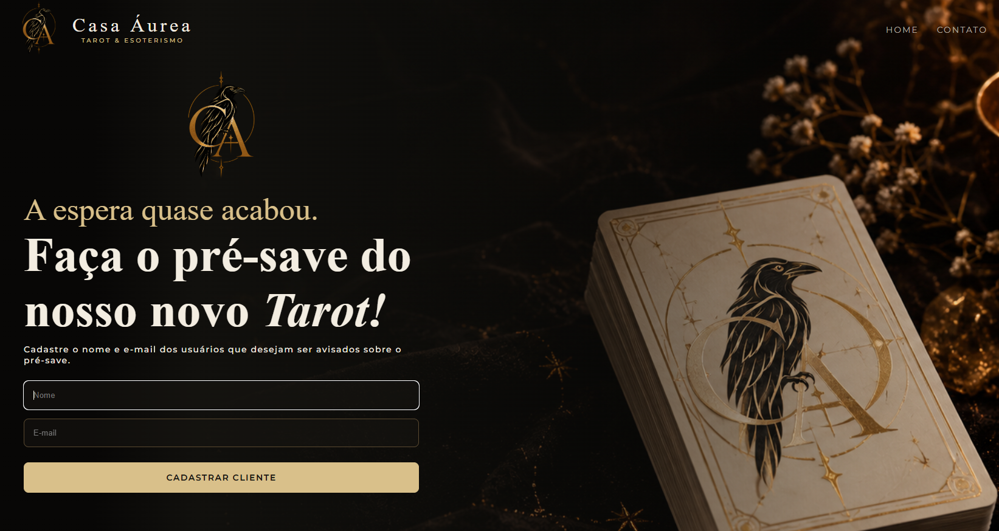
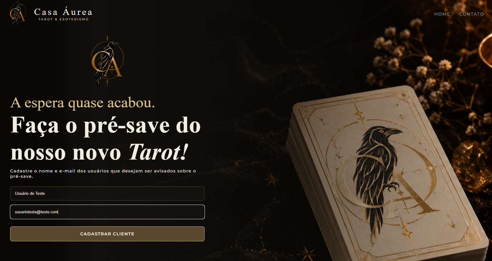
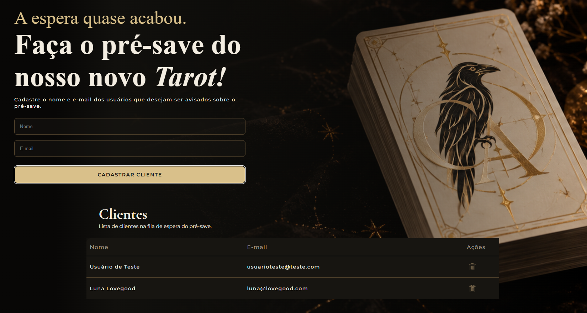
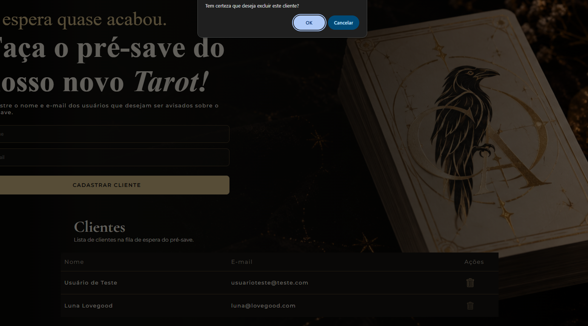

# 🌙 Casa Áurea - Cadastro de Clientes

Sistema de cadastro desenvolvido para a **Casa Áurea**, mimha marca de leitura de Tarot, para gerenciar os clientes interessados na **pré-venda de baralho** (é um baralho fictício).

Projeto desenvolvido na formação **Front-end da EBAC**, praticando **consumo de API REST** e operações de **CRUD** com **JavaScript puro**.

### 🛠️ Tecnologias
- HTML5
- CSS3
- Javascript 
- JSONBin.io - API REST para persistência de dados em nuvem

### ✨ Funcionalidades
- **Cadastrar cliente**: nome e e-mail são salvos diretamente na API;
- **Listar clientes**: todos os cadastros são exibidos em tela, atualizados em tempo real;
- **Excluir cliente**: remoção direta na API, com feedback via alerta.

### 📸 O projeto em ação

**Interface inicial:**

**Primeiro cliente sendo cadastrado:**

**Lista com clientes cadastrados:**

**Exclusão de cliente:**

### Como usar
1. Abra o `index.html` no navegador;
2. Preencha **nome** e **e-mail** do cliente;
3. Clique em **Cadastrar** - o registro é salvo na API e aparece na lista;
4. Clique em **Excluir** ao lado de um cliente para removê-lo da API.

### Notas
- A aba **Contato** compõe a identidade visual da marca e existe apenas para fins estéticos.
- Por ser um projeto de estudo, a chave da API fica no front-end; em produção, esse tipo de credencial deve ser protegido no back-end.

---
Desenvolvido com 💜 por Laura Tomazelli ·