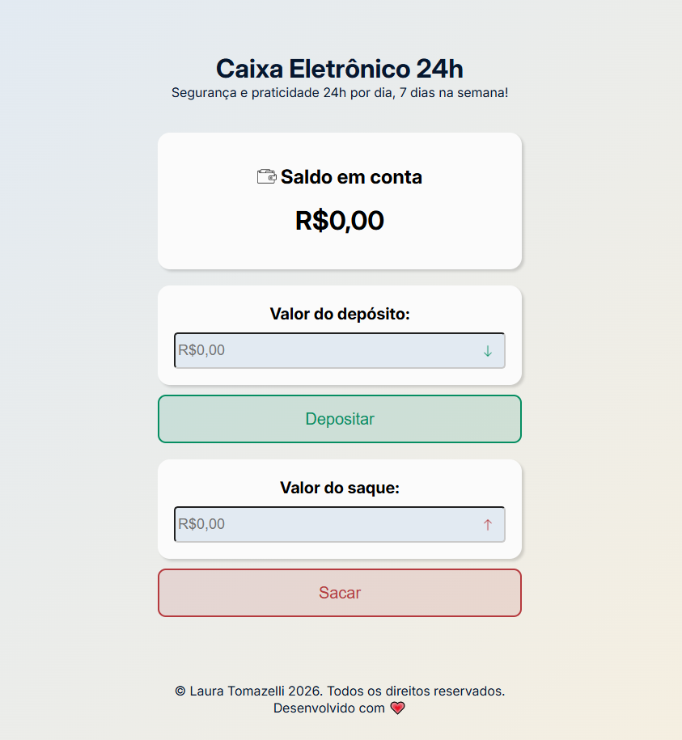
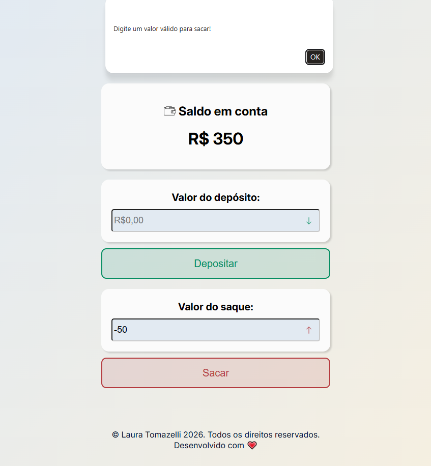
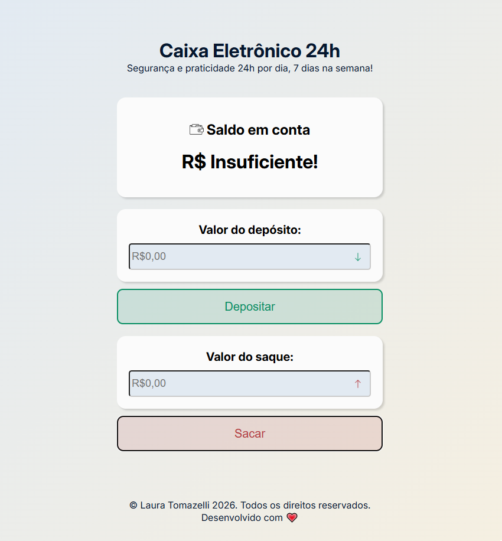
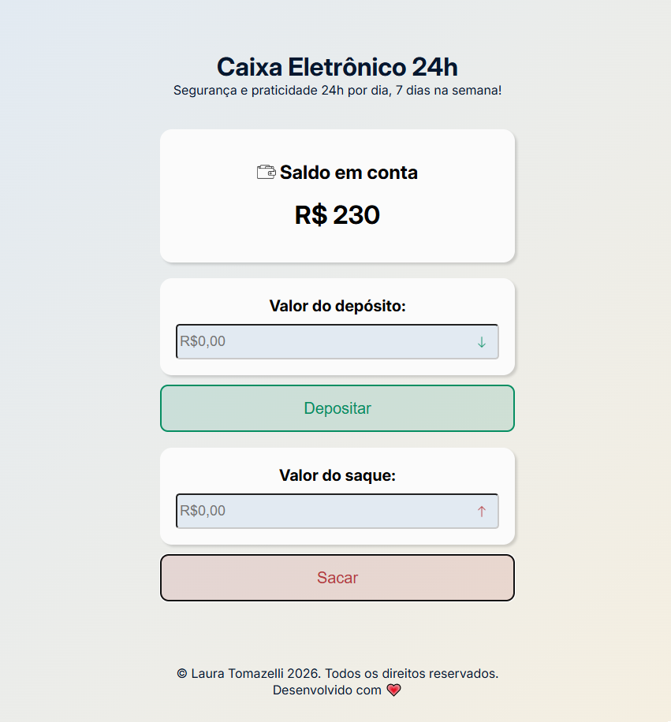

# Caixa Eletrônico

Simulador de caixa eletrônico desenvolvido em aula na formação **Front-end da EBAC**, para praticar **HTML5**, **CSS3** e **JavaScript**, em específico a POO.

O projeto permite realizar operações bancárias básicas como depósito, saque e consulta de saldo, com validação de valores e histórico de transações.

### Tecnologias
- HTML5
- CSS3
- JavaScript

### Como usar
1. Abra o arquivo `index.html` no navegador;
2. Digite o valor da operação;
3. Selecione **Depositar** ou **Sacar**;
4. O saldo é atualizado automaticamente.

### Funcionalidades
- Validação de entrada (apenas valores positivos)
- Verificação de saldo disponível para saques
- Interface intuitiva e responsiva

---
Desenvolvido com 💖 por Laura Tomazelli