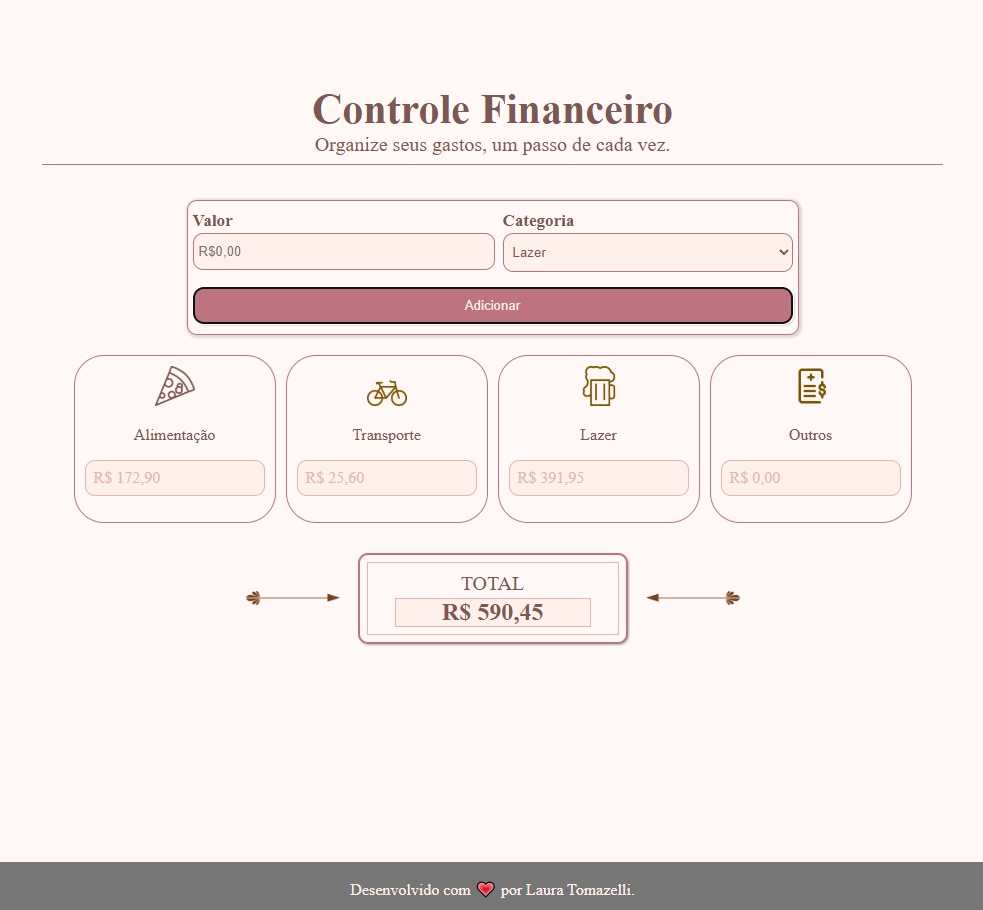

# Calculadora de Controle Financeiro

Aplicação web desenvolvida em aula na formação **Front-end da EBAC**, para praticar **HTML5**, **CSS3** e **JavaScript**.

O projeto permite registrar gastos por categoria (Alimentação, Transporte, Lazer e Outros) e acompanhar o total em tempo real.

### Tecnologias
- HTML5
- CSS3
- JavaScript

### Como funciona
1. Digite o valor do gasto;
2. Selecione a categoria;
3. Clique em **Adicionar**;
4. O valor entra no card da categoria e o **TOTAL** é atualizado.

---
Desenvolvido com 💖 por Laura Tomazelli