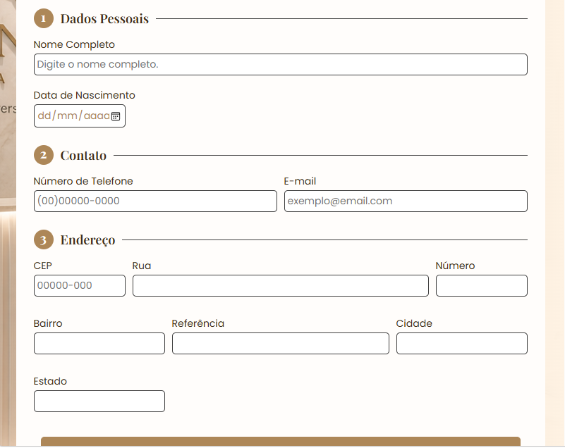
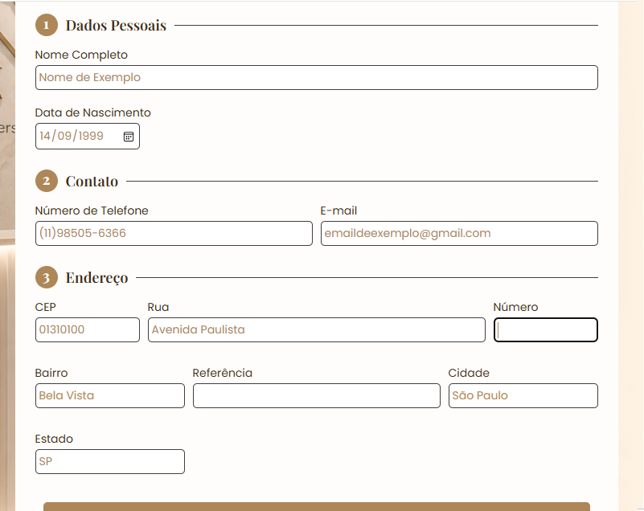
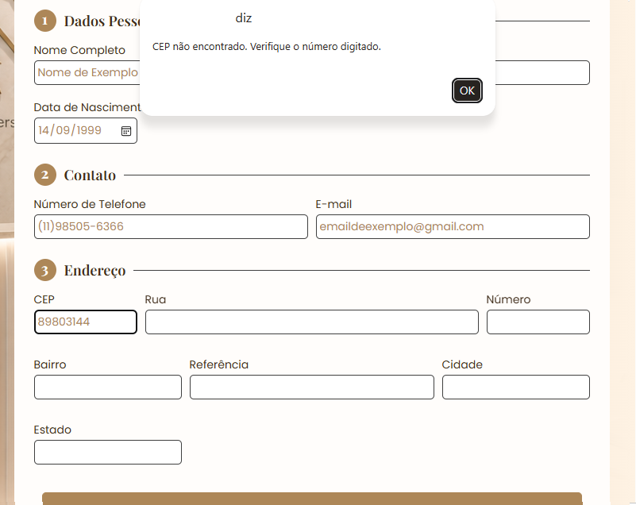
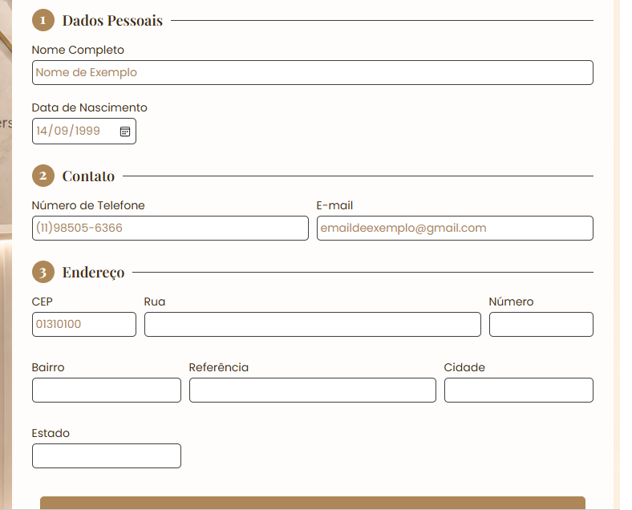

# Atividade Formulário 

Aplicação desenvolvida para a formação **Front-end da EBAC**, praticando **JavaScript**, **Fetch API** e **Web Storage API**.

O projeto simula o cadastro de pacientes de uma clínica de estética: ao digitar o CEP, o endereço é preenchido automaticamente via API ViaCEP, e todos os dados são salvos no navegador, nada se perde ao recarregar a página.

### Tecnologias
- HTML5
- CSS3
- JavaScript
- Fetch API (ViaCEP)
- Web Storage API (localStorage)

### Funcionalidades
- **Preenchimento automático de CEP**: ao digitar o CEP, os campos de endereço se completam sozinhos;
- **Salvamento automático**: os dados digitados são guardados no navegador em tempo real;
- **Restauração ao carregar**: ao abrir a página novamente, o formulário está como foi deixado;
- **Layout responsivo**: pensado para desktop, notebook e tablet, usados em clínica.

### O projeto em ação

**Interface inicial:**

**Endereço preenchido automaticamente via ViaCEP:**

**Mensagem de erro após digitar CEP inválido:**

**Dados preservados após recarregar a página:**

### Como testar
1. Abra o `index.html` no navegador;
2. Preencha os dados do paciente;
3. Digite um **CEP**, pressione enteder ou clique fora da caixa do CEP e veja o endereço se completar sozinho;
4. Aperte **F5** ou atualize a página: os dados continuam lá.

### Decisão de design
O layout foi pensado priorizando **desktop, notebook e tablet**, que é o contexto real de uso em uma recepção de clínica. Por isso, a interface não é otimizada para telas muito estreitas (celular).

---
Desenvolvido com 💖 por Laura Tomazelli