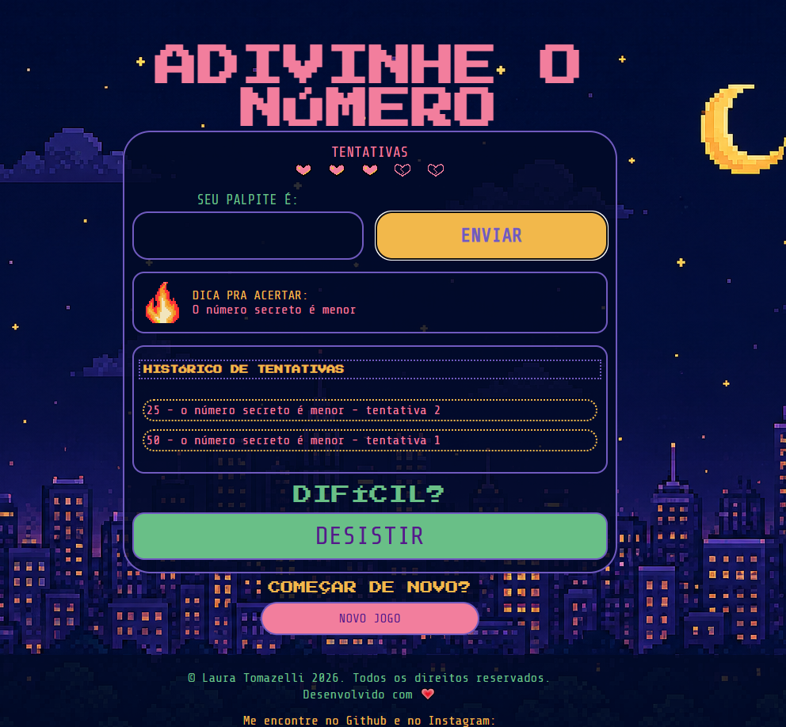
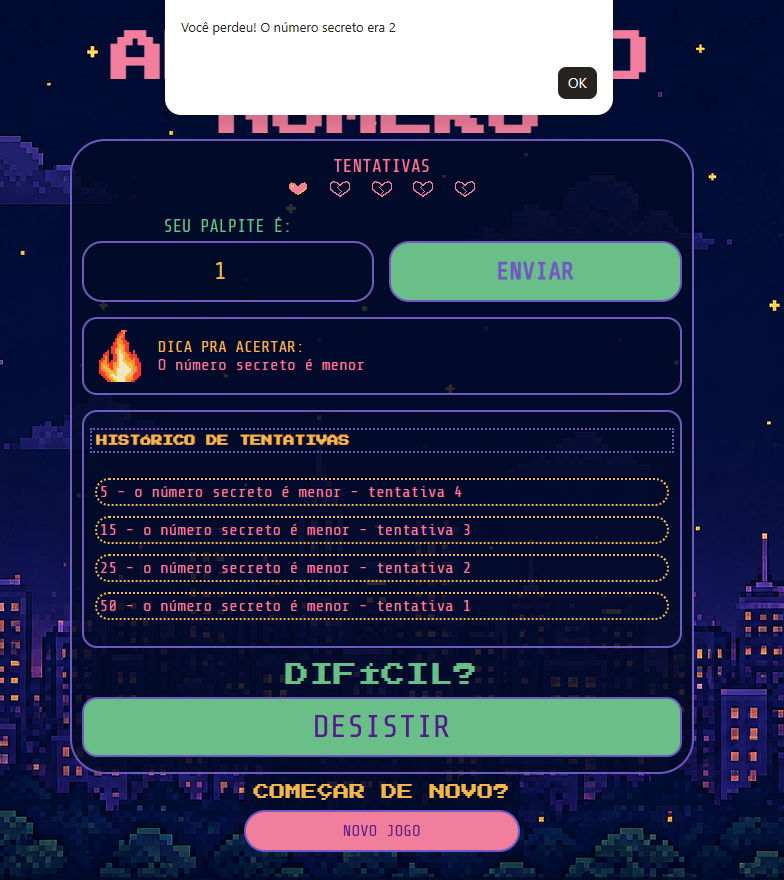

# Jogo de Adivinhação

Jogo interativo desenvolvido em aula na formação **Front-end da EBAC**, para praticar **HTML5**, **CSS3** e **JavaScript**.

O jogador deve adivinhar um número secreto entre 1 e 100, recebendo dicas se o chute foi muito alto ou muito baixo.

### Tecnologias:
- HTML5
- CSS3
- JavaScript

### Como jogar
1. Abra o arquivo `gamepage.html` no navegador;
2. Digite um número entre 1 e 100;
3. Clique em **Enviar**;
4. O jogo informa se o número secreto é mais alto, mais baixo ou se você acertou;
5. Tente descobrir em menos tentativas possíveis, são no máximo 5.

### Recursos
- Validação de entrada (apenas números válidos);
- Feedback visual em tempo real;
- Contador de tentativas;
- Mensagens personalizadas;

---
Desenvolvido com 💖 e muito café, por Laura Tomazelli