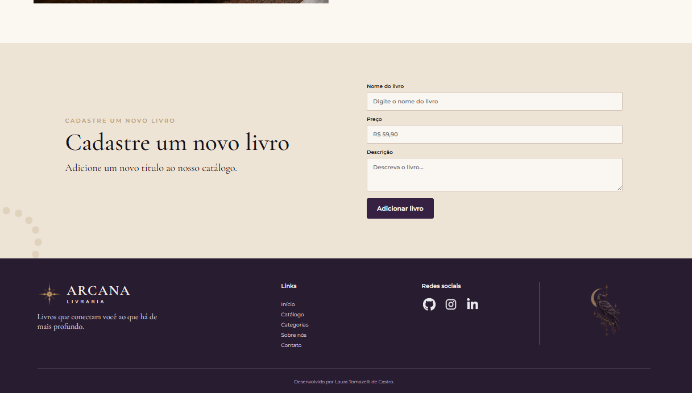

# Atividade React - Arcana Livraria

Projeto desenvolvido em React como parte dos estudos de desenvolvimento Front-End.

A Arcana Livraria é uma livraria fictícia voltada para livros relacionados a autoconhecimento, espiritualidade, simbolismo, astrologia e magia natural.

## Sobre o projeto

O projeto foi desenvolvido utilizando React e Vite, com foco na criação de componentes reutilizáveis, gerenciamento de estado e interação com o usuário.

A aplicação apresenta um catálogo de livros, permite visualizar detalhes dos produtos, adicionar novos livros através de um formulário e adicionar produtos ao carrinho.

## Funcionalidades

- Página inicial com hero e navegação
- Categorias de livros
- Catálogo de produtos
- Destaque de produto
- Visualização de detalhes dos livros
- Adição de livros ao catálogo através de formulário
- Exclusão de livros adicionados pelo usuário
- Carrinho com contador de itens
- Mensagens de confirmação das ações
- Carregamento inicial dos produtos
- Alternância automática entre imagens da livraria
- Efeito de fade entre as imagens
- Rodapé com links para redes sociais

## Tecnologias utilizadas

- React
- JavaScript
- Vite
- HTML
- CSS
- Git
- GitHub

## Conceitos de React utilizados

Durante o desenvolvimento foram utilizados conceitos importantes do React, como:

- Componentização
- Props
- `useState`
- `useEffect`
- `useMemo`
- Renderização de listas com `.map()`
- Formulários controlados
- Manipulação de eventos
- Renderização condicional

## Preview

### Menu e Hero

### Catálogo

### Formulário e Footer

